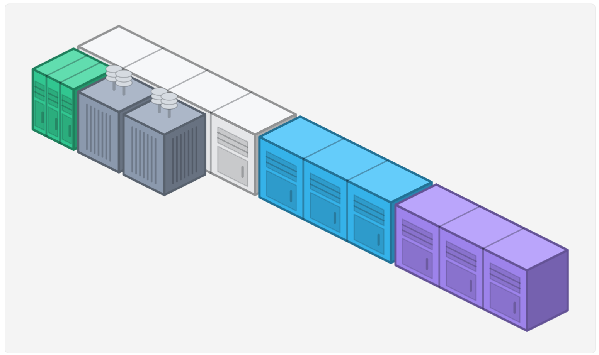

# PowerBlock

A web tool for planning an industrial battery site. You enter how many of each battery
you want; it auto-adds the required transformers and shows the total cost, land size,
and net energy, plus a to-scale layout of the site (capped at 100 ft wide). You can
save a configuration and reopen it later from a shareable link. State lives on the
server, so the link survives a browser cache clear.

**Live demo:** https://powerblock.fly.dev/



## Running it

Everything runs from one command on port 8000:

```bash
make run          # builds the frontend, embeds it, runs the server
# or
docker compose up
```

Then open http://localhost:8000.

`make dev` runs Vite (hot reload) alongside the Go API for development, and `make test`
runs the Go and frontend tests. Building locally needs Go 1.26+ and Node 20+; with
Docker you need neither.

It's deployed on Fly.io ([live demo](https://powerblock.fly.dev/)); pushes to `master`
auto-deploy via GitHub Actions.

## Stack

- **Backend:** Go, standard library. Owns the catalog, pricing, transformer rule,
  energy math, and the layout packing. All of it is unit-tested.
- **Frontend:** React + TypeScript + SCSS (Vite). It only renders what the backend
  returns; there's no business logic on the client.
- **Storage:** SQLite behind a small `Store` interface. The driver is pure Go
  (`modernc.org/sqlite`), so the binary is fully static.

The built frontend is embedded into the Go binary with `go:embed`, so the whole app
ships as one static binary serving the API and the UI on a single port.

The backend is layered: `catalog` (the device source of truth) → `engine` (cost,
energy, and transformer math) → `layout` (packing), with `store` behind an interface
for persistence and `httpapi` exposing it all. Dependencies point one way, and all the
logic lives server-side; the React client just renders what the API returns.

```
cmd/server/        entrypoint: config, wiring, graceful shutdown
internal/
  catalog/         device specs (the source of truth)
  engine/          cost, energy, transformer math
  layout/          shelf-packing into ≤100 ft rows
  store/           Store interface + SQLite implementation
  httpapi/         JSON API + serves the embedded frontend
web/src/
  components/      React UI (configurator, summary, layout, …)
  services/        typed API client
  types/           shared domain types
  utils/           formatters, colors, isometric geometry
```

## How it works

Four batteries are selectable. Transformers are added automatically (one per two
batteries); the user never picks them.

| Device | Size | Energy | Cost |
|--------|------|--------|------|
| MegapackXL | 40×10 ft | +4 MWh | $120,000 |
| Megapack2 | 30×10 ft | +3 MWh | $80,000 |
| Megapack | 30×10 ft | +2 MWh | $50,000 |
| PowerPack | 10×10 ft | +1 MWh | $10,000 |
| Transformer | 10×10 ft | −0.5 MWh | $10,000 |

```
transformers = ceil(batteryCount / 2)
totalCost    = Σ(qty × cost) + transformers × $10,000
netEnergy    = Σ(qty × MWh)  − transformers × 0.5 MWh
```

Every device is 10 ft deep, so the layout is a shelf-packing problem: fill 10-ft rows
left to right (widest device first) and wrap to a new row at 100 ft. Land size is the
bounding box of the result. The layout has a to-scale 2D plan and an optional isometric
3D view.

Quick check, 2× MegapackXL + 1× Megapack + 2× PowerPack: 5 batteries means 3
transformers, which comes out to **$340,000**, **10.5 MWh**, on a 100 × 20 ft footprint.

## API

The UI shows numbers and a layout, never raw JSON, but there's a small API behind it:

- `GET /api/catalog` — the device list
- `POST /api/calculate` — `{quantities}` → totals + layout
- `POST /api/sessions` — save a config, returns a short share code
- `GET /api/sessions/{code}` — load a saved config

Saving puts the code in the URL (`/?s=CODE`); opening that link reloads the config from
the server, which is how save/resume survives a cache clear.

## Assumptions

- The brief doesn't define "industrial battery," so I count all four battery types
  toward the transformer ratio (transformers don't count toward their own total).
- It mentions "energy density" but the example shows a single energy total, so net
  energy (MWh) is the headline figure and energy density is a small secondary stat.
- Quantities are capped at 0–1000 per device and validated on the server.

## A few decisions

- The math runs on the server so there's a single source of truth. The cost is a
  request per edit, which I debounce, and cancel in-flight with an `AbortController` so
  a slow response can't overwrite a newer one.
- Packing is first-fit (widest first). Simple, deterministic, and easy to test, though
  not the tightest possible layout.
- The layout is SVG, not canvas, so I get crisp scaling, hover tooltips, and
  accessibility for free. The cost is DOM weight at high block counts, which is why it
  drops per-block detail past a few hundred blocks.